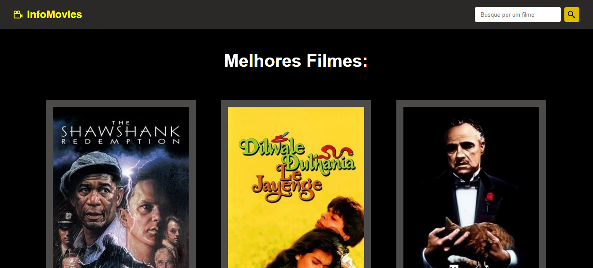
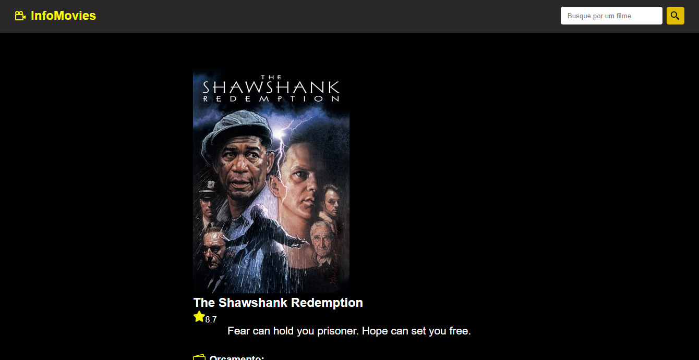
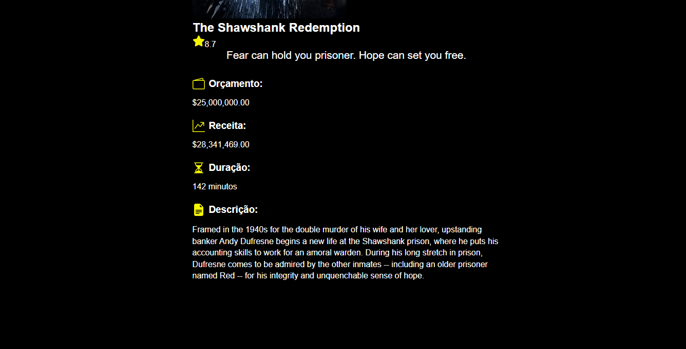
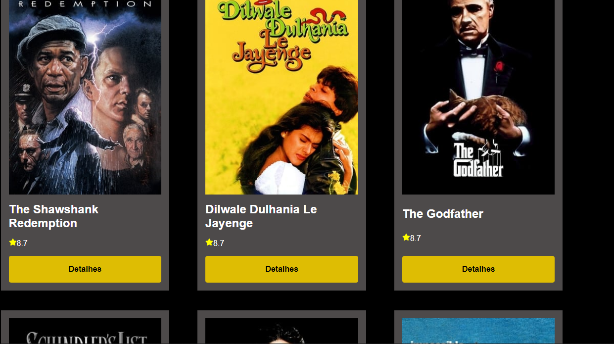

# InfoFilmes_Projeto_ReactJS

Este projeto teve apenas como fim por em prática os meus 
conhecimentos aprendido com videoaula do prof Matheus Battisti do canal
<a href='https://www.youtube.com/c/MatheusBattisti'>Hora de Codar.<a/>

## Link do Projeto em Produção:

Clique <a href='https://kswdigital.surge.sh/'>aqui<a/> ou copie e cole o link "https://kswdigital.surge.sh/" no seu navegador

## Algumas telas

### Obs: 
Api parou de fazer pesquisas depois que adicionei no surge.sh mas estou trabalhando nisso
